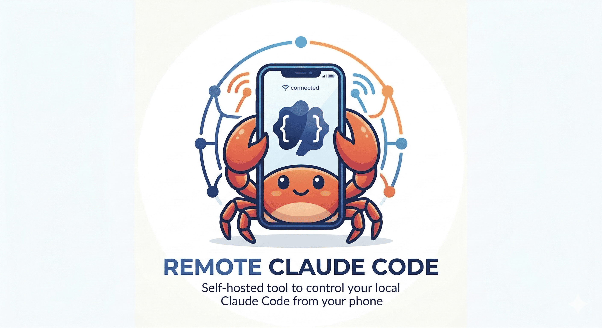

[中文](./README.zh-CN.md) | **English**

<p align="center">
  
</p>

# Remote Claude Code

Self-hosted tool to remotely control your local [Claude Code](https://docs.anthropic.com/en/docs/claude-code) from your phone — via Cloudflare Tunnel + PWA.

## Features

- **Remote Access** — Instantly expose your local Claude Code via Cloudflare Quick Tunnel, no configuration needed
- **PWA** — Install as a native-feeling app on your phone with offline support
- **Real-time Streaming** — WebSocket-based full-duplex communication with live text, thinking blocks, and tool call visualization
- **Multi-thread** — Create, switch, and resume multiple chat sessions, powered by Claude Agent SDK's session management
- **Tool Call Visualization** — See file edits, bash commands, and other tool uses as they happen
- **Thinking Blocks** — View Claude's reasoning process in real time
- **Light/Dark Theme** — Automatic or manual theme switching with Claude/Anthropic brand colors
- **Password Auth** — Secure access with bcrypt-hashed password + JWT tokens
- **File Attachments** — Upload files to provide context for your conversations
- **Project Switching** — Switch between different local project directories
- **Model Selection** — Choose from available Claude models
- **MCP Integration** — Works with configured MCP servers
- **Built-in Terminal** — Interactive terminal panel supports Windows (Bun pipe mode) and POSIX PTY

## Tech Stack

| Layer | Technology |
|-------|-----------|
| Runtime | [Bun](https://bun.sh) |
| Backend | [Hono](https://hono.dev) |
| Frontend | React 19 + Vite |
| Styling | Tailwind CSS v4 + shadcn/ui |
| AI | [@anthropic-ai/claude-agent-sdk](https://www.npmjs.com/package/@anthropic-ai/claude-agent-sdk) |
| Tunnel | [cloudflared](https://www.npmjs.com/package/cloudflared) |
| Database | Bun built-in SQLite (WAL mode) |
| Auth | Bun.password (bcrypt) + Hono JWT |
| PWA | vite-plugin-pwa |

## Quick Start

### Prerequisites

- [Bun](https://bun.sh) v1.0+
- [Claude Code](https://docs.anthropic.com/en/docs/claude-code) configured on your machine

### Install

```bash
# Using npm
npm install -g remote-claude-code

# Or using bun
bun add -g remote-claude-code
```

### Run

```bash
rcc start
```

That's it. The server starts on `http://localhost:3456` and automatically creates a Cloudflare Tunnel.
All available access URLs are printed in the terminal — open any of them on your phone.

On first visit, you'll be prompted to set a password.

## CLI Reference

```
rcc start                        Start server in background
      --port <n>                   Listen on port n (default: 3456)
      --no-tunnel                  Disable Cloudflare Tunnel
      --no-tailscale               Disable Tailscale detection
rcc stop                         Stop the server
rcc status                       Show PID, uptime, and access URLs
rcc logs                         Print recent server logs
      -f, --follow                 Stream new log lines (like tail -f)
      --lines <n>                  Number of lines to show (default: 50)
rcc setup                        Rebuild frontend (only needed after source updates)
```

## Development

### Clone & run from source

```bash
git clone https://github.com/anthropics/remote-claude-code.git
cd remote-claude-code
bun install
bun link       # register `rcc` globally from this directory
rcc setup      # build frontend (first time only)
rcc start
```

### Dev server

```bash
bun run dev          # server (watch) + Vite dev server concurrently
bun run dev:server   # server only
bun run dev:client   # Vite dev server only
bun run build        # build frontend
```

### Windows Terminal Troubleshooting

- On Windows, terminal sessions run in pipe mode (`stdin/stdout`) because Bun PTY is POSIX-only.
- If "Create Terminal" fails, verify your configured shell exists, then restart the server.
- Default Windows shell probe order: `pwsh.exe` → `powershell.exe` → `cmd.exe`.

## Environment Variables

| Variable | Description | Default |
|----------|-------------|---------|
| `PORT` | Server port | `3456` |
| `RCC_JWT_SECRET` | JWT signing key | Auto-generated and persisted in DB |
| `NO_TUNNEL` | Set to `1` to disable Cloudflare Tunnel | — |
| `NO_TAILSCALE` | Set to `1` to disable Tailscale detection | — |

## Architecture

```
cli/
├── index.ts              # CLI entry point (rcc command)
├── constants.ts          # Shared constants (APP_NAME)
├── commands/
│   ├── start.ts          # rcc start — spawn background server process
│   ├── stop.ts           # rcc stop  — kill server by PID
│   ├── status.ts         # rcc status
│   ├── logs.ts           # rcc logs
│   └── setup.ts          # rcc setup
└── utils/
    ├── process-manager.ts # PID-file-based cross-platform process management
    └── server.ts          # Health check & network info helpers

server/
├── index.ts       # HTTP entry, routes, static files
├── ws.ts          # WebSocket handler & message routing
├── claude.ts      # ClaudeSessionManager (wraps SDK query())
├── auth.ts        # Password setup/login (bcrypt + JWT)
├── db.ts          # SQLite DataStore (~/.remote-claude-code/data.db)
├── threads.ts     # Thread listing/history API
├── tunnel.ts      # Cloudflare Quick Tunnel
├── tailscale.ts   # Tailscale IP detection
├── upload.ts      # File upload routes
└── projects.ts    # Project management routes

src/
├── App.tsx
├── pages/
│   ├── Chat.tsx           # Main chat UI
│   └── Login.tsx          # Auth page
├── components/
│   ├── MessageList.tsx
│   ├── MessageBubble.tsx
│   ├── InputBar.tsx       # Chat input + attachments
│   ├── ThreadSidebar.tsx
│   ├── ToolCallCard.tsx
│   ├── ThinkingBlock.tsx
│   ├── MarkdownRenderer.tsx
│   └── ui/                # shadcn/ui components
├── hooks/
│   ├── useAuth.ts
│   ├── useWebSocket.ts
│   ├── useMessages.ts
│   ├── useThreads.ts
│   └── useTheme.ts
├── types/messages.ts
└── styles/globals.css
```

## WebSocket Protocol

**Client → Server:** `auth`, `chat`, `interrupt`, `abort`, `ping`

**Server → Client:** `status`, `auth_result`, `chat_started`, `stream_delta`, `thinking_delta`, `thinking_start`, `thinking_end`, `tool_start`, `tool_input_delta`, `block_stop`, `assistant_message`, `system_init`, `result`, `chat_complete`, `error`

## Data Storage

All persistent data lives in `~/.remote-claude-code/`:

| Path | Contents |
|------|----------|
| `data.db` | SQLite database — config, sessions, messages |
| `rcc-process.json` | Running server PID and metadata |
| `logs/rcc-out.log` | Server output log (viewed with `rcc logs`) |

Chat sessions are managed by Claude Agent SDK in `~/.claude/projects/`.

## License

MIT
